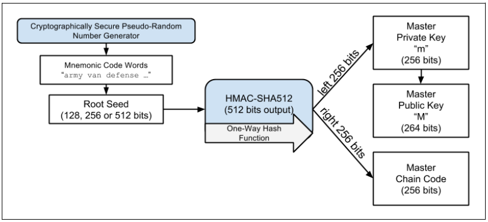

# Chapter 05. Wallets

## Two perspectives

- For common users, a wallet is just a GUI app serving for
  - controling access to a user's money
  - managing keys and addresses
  - tracking the balance
  - creating and signing transactions
- For programmers, the word "wallet" refers to the data structure used to store and manage a user's keys

## Wallet Technology Overview

- Bitcoin wallets contain no bitcoins
- Users control the coins on the network by signing transactions with the **keys** in their wallets
- A bitcoin wallet is a **keychain**
- 2 primary types of wallets
  - **nondeterministic wallet**: each key is independently generated from a random number, a.k.a., **JBOK** (Just a Bunch Of Keys)
  - **deterministic wallet**
    - All keys are derived from a single master key known as **seed**
    - The most common one is called **HD (hierarchical deterministic) wallet**
    - Seeds are encoded as English words, a.k.a., **mnemonic code words**

### Nondeterministic (Random) Wallets

- **Disadvantage**
  - Each generated key must be backed up, requiring frequent backup of the wallet
  - Violate the the principle of **avoiding address reuse** (one address for one tx only)
    > The use of nondeterministic wallets is discouraged for anything other than simple tests
- Its type is indexed by `0`

### Deterministic (Seeded) Wallets

- **DEFINITION**: Deterministic, or "seeded," wallets are wallets that contain private keys that are all derived from a common seed, through the use of a one-way hash function
- The seed is sufficient to
  - recover all the derived keys
  - export or import a wallet, allowing for easy migration of all the user's keys between different wallet implementations
- A demo of Type-1 deterministic (seeded) wallet: a deterministic sequence of keys derived from a seed goes as
  

### HD Wallets (BIP-32/BIP-44)

- A demo of Type-2 HD wallet generating a tree of keys derived from a single seed goes as
  
- **2 advantages**
  - The tree structure can be used to express additional organizational meaning
  - Users can create a sequence of public keys without having access to the corresponding private keys

### Seeds and Mnemonic Codes (BIP-39)

- An enhancement for HD wallets is to create seeds from a sequence of English words (a.k.a., **mnemonic** defined in BIP-39) that are easy to transcribe, export, and import across wallets

### Wallet Best Practices

- 4 standards are
  - Mnemonic code words, based on [BIP-39](https://github.com/bitcoin/bips/blob/master/bip-0039.mediawiki)
  - HD wallets, based on [BIP-32](https://github.com/bitcoin/bips/blob/master/bip-0032.mediawiki)
  - Multipurpose HD wallet structure, based on [BIP-43](https://github.com/bitcoin/bips/blob/master/bip-0043.mediawiki)
  - Multicurrency and multiaccount wallets, based on [BIP-44](https://github.com/bitcoin/bips/blob/master/bip-0044.mediawiki)
- Examples
  - Softwares: Breadwallet, Copay, Multibit HD, and Mycelium
  - Hardwares: Keepkey, Ledger, and Trezor

### Using a Bitcoin Wallet

- Demo with [Trezor](https://trezor.io/)

## Wallet Technology Details

### Mnemonic Code Words (BIP-39)

- **DEFINITION**: Word sequences that represent (encode) a random number used as a seed to derive a deterministic wallet
  > The primary difference is that a brainwallet consists of words chosen by the user, whereas mnemonic words are created randomly by the wallet and presented to the user.

#### Generating mnemonic words

Generating entropy and encoding as mnemonic words goes as

#### From mnemonic to seed

- Tool: the key-stretching function [**PBKDF2**](https://en.wikipedia.org/wiki/PBKDF2)
- Two parameters: the **mnemonic** and a **salt**
  - Salts help to
    - thwart brute-force attack by means of pre-built lookup tables
    - introduce a passphrase serving as an additional security factor protecting the seed
- From mnemonic to seed is depicted as
  

#### Optional passphrase in BIP-39

- The optional passphrase creates two important features
  - A second factor (something memorized) that makes a mnemonic useless on its own, protecting mnemonic backups from compromise by a thief
  - A form of **plausible deniability or "duress wallet,"** where a chosen passphrase leads to a wallet with a small amount of funds used to _distract an attacker from the "real" wallet that contains the majority of funds_
- Risk of loss
  - If the wallet owner is incapacitated or dead and no one else knows the passphrase, the seed is useless and all the funds stored in the wallet are lost forever.
  - Conversely, if the owner backs up the passphrase in the same place as the seed, it defeats the purpose of a second factor.

#### Working with mnemonic codes

Several implementations

- [python-mnemonic](https://github.com/trezor/python-mnemonic)
- [bitcoinjs/bip39](https://github.com/bitcoinjs/bip39)
- [libbitcoin/mnemonic](https://github.com/libbitcoin/libbitcoin-system/blob/master/src/wallet/mnemonic.cpp)
- The page (https://iancoleman.io/bip39/) can be used offline in a browser, or accessed online

### Creating an HD Wallet from the Seed

- HD wallets are created from a single root seed, which is a 128-, 256-, or 512-bit random number, depicted as
  

#### Private child key derivation

- HD wallets use a **child key derivation (CKD)** function to derive child keys from parent keys
- The child key derivation functions are based on a one-way hash function that combines:
  - A parent private or public key (ECDSA uncompressed key)
  - A seed called a chain code (256 bits)
  - An index number (32 bits)
- The chain code is used to introduce deterministic random data to the process, so that knowing the index and a child key is not sufficient to derive other child keys

The derivation process is depicted as

#### Using derived child keys

- 2 usages
  - derive a public key and a bitcoin address
  - sign txs o spend anything paid to that address

#### Extended keys

- **DEFINITION**: The key combined with chain code
- Extended keys are stored and represented simply as the concatenation of the **256-bit key** and **256-bit chain code** into a 512-bit sequence
- 2 types
  - An extended private key is the combination of a private key and chain code and can be used to derive child private keys (and from them, child public keys)
  - An extended public key is a public key and chain code, which can be used to create child public keys (public only)
- Extended keys are encoded using Base58Check, to easily export and import between different BIP-32–compatible wallets. The resultant prefix goes as `xprv` (for private keys) and `xpub` (for public keys)

#### Public child key derivation

- Child public keys can be derived from parent public keys without knowledge of parent private keys
- This shortcut can be used to create very secure public key–only deployments where a server or application has a copy of an extended public key and no private keys whatsoever
- Another common application of this solution is for **cold-storage** or **hardware wallets**
- Depicted as
  

### Using an Extended Public Key on a Web Store

- Demo with [Mycelium Gear](https://gear.mycelium.com/)

#### Hardened child key derivation

- **Problem**: The known/leaked child private key can be combined with the public chain code to derive **all other child private keys** and the **the parent private key**
- **Solution**: hardened derivation depicted as
  
