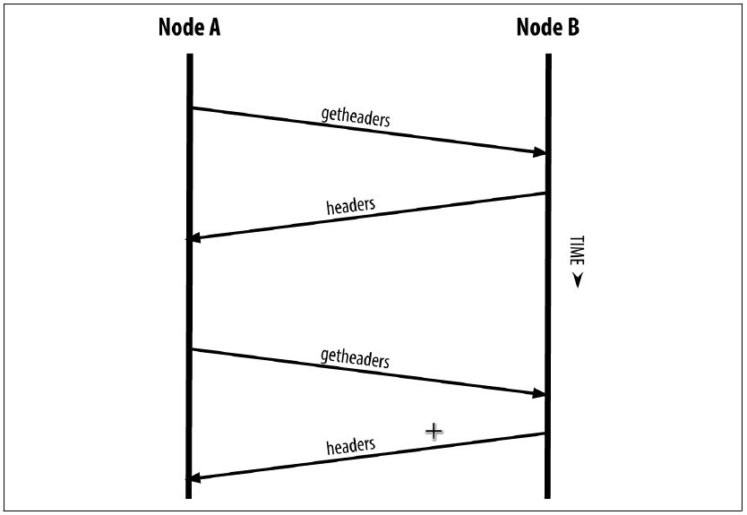
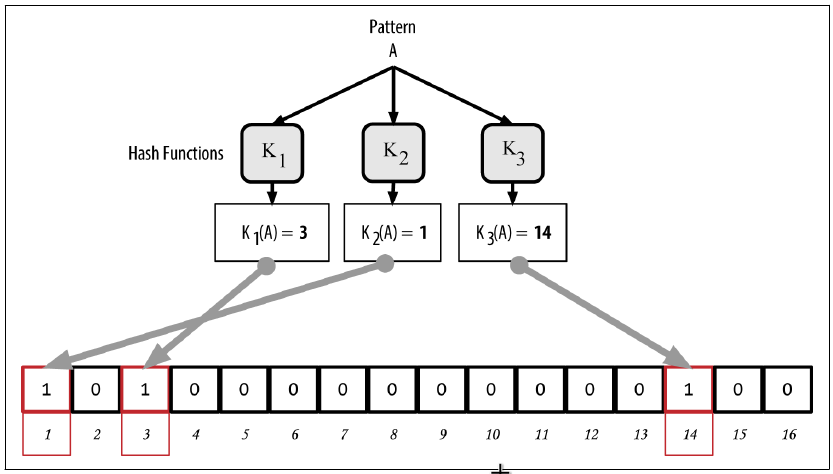

# Chapter 08. The Bitcoin Network

## Simplified Payment Verification (SPV) Nodes

- **WHY**: Many bitcoin clients are designed to run on space- and power-constrained devices, such as smartphones, tablets, or embedded systems
- **SPV**/**Lightweight** clients: Bitcoin clients operate without storing the full blockchain
- **SPV nodes download only the block headers** and do not download the transactions included in each block
- SPV nodes cannot construct a full picture of all the UTXOs that are available for spending
- SPV nodes verify transactions using a slightly different methodology that **relies on peers to provide partial views of relevant parts of the blockchain on demand**
- **SPV verifies transactions by reference to their depth** (i.e., the number of mined block following it) in the blockchain instead of their height
- An SPV node cannot validate whether the UTXO is unspent
- The SPV node will establish a link between the transaction and the block that contains it, using a merkle path
- Six more blocks bearing necessary work on top of a block of interest is a proof, by proxy, that the transaction was not a double-spend
- The SPV node establishes the existence of a transaction in a block by
  - requesting **a merkle path proof**, and
  - validating the Proof-of-Work in the chain of blocks
- To defend against double-spending attack, an SPV node needs to connect randomly to several nodes, to increase the probability that it is in contact with at least one honest node
- Random connections introduce vulnerability to **network partitioning attacks** or **Sybil attacks**
- To get the block headers, SPV nodes use a `getheaders` message instead of `getblocks`. The responding peer will send up to 2,000 block headers using a single `headers` message
  

- Any transactions of interest are retrieved using a `getdata` request. The peer generates a `tx` message containing the transactions, in response
- Because SPV nodes need to retrieve specific transactions in order to selectively verify them, they also create a privacy risk.
- Bitcoin developers added a feature called **bloom filters** to address the privacy risks of SPV nodes

## Bloom Filters

- **DEFINITION**: A bloom filter is a probabilistic search filter, a way to describe a desired pattern without specifying it exactly
- **Use case**: Used by SPV nodes to ask their peers for transactions matching a specific pattern, without revealing exactly which addresses, keys, or transactions they are searching for

### How Bloom Filters Work

- Bloom filters are implemented as a variable-size array of `N` binary digits (a bit field) and a variable number of `M` hash functions
- The hash functions are designed to always produce an output that is between `1` and `N`, corresponding to the array of binary digits
- Once all M hash functions have been applied, the search pattern for a given input will be "recorded" in the bloom filter as `M` bits that have been changed from `0` to `1`
- The pattern is hashed by each hash function in turn and the result is recorded by setting the bits to `1`, depicted as
  

- The bloom filter gets less accurate as more patterns are added
- To test if a pattern is part of a bloom filter,
  - The pattern is hashed by each hash function and the resulting bit pattern is tested against the bit array
  - If all the bits indexed by the hash functions are set to `1`, then the pattern is **probably** recorded in the bloom filter
- A negative matching is definitively not recorded in bloom filters

## How SPV Nodes Use Bloom Filters

- The SPV node will then make a list of all the **addresses**, **keys**, and **hashes** of interest by extracting the **public key hash** and **script hash** and **transaction IDs** from any **UTXO** controlled by its wallet
- The SPV node will the query with a `filterload` message containing the bloom filter to use on the connection
- The serving peer (a full node) will check several parts of the transaction against the bloom filter, looking for a match including
  - The transaction ID
  - The data components from the locking scripts of each of the transaction outputs (every key and hash in the script)
  - Each of the transaction inputs
  - Each of the input signature data components (or witness scripts)
- After a filter is established, the peer will filter out **each transaction's outputs** based on the bloom filter and only send the matching ones to the SPV node
- In response to a `getdata` message from the node, peers will send a `merkleblock` message that contains only block headers for blocks matching the filter and a merkle path for each matching transaction
- Based on the `merkleblock` response, the SPV node
  - discards any false positives
  - uses the correctly matched transactions to update its UTXO set and wallet balance
- The node setting the bloom filter can interactively add patterns to the filter by sending a `filteradd` message
- To clear the bloom filter, the node can send a `filterclear` message
- A node has to clear and resend a new bloom filter if a pattern is no longer desired
- The network protocol and bloom filter mechanism for SPV nodes is defined in [BIP-37 (Peer Services)](https://github.com/bitcoin/bips/blob/master/bip-0037.mediawiki)

## SPV Nodes and Privacy

- Bloom filters are a way to **reduce** the loss of privacy
