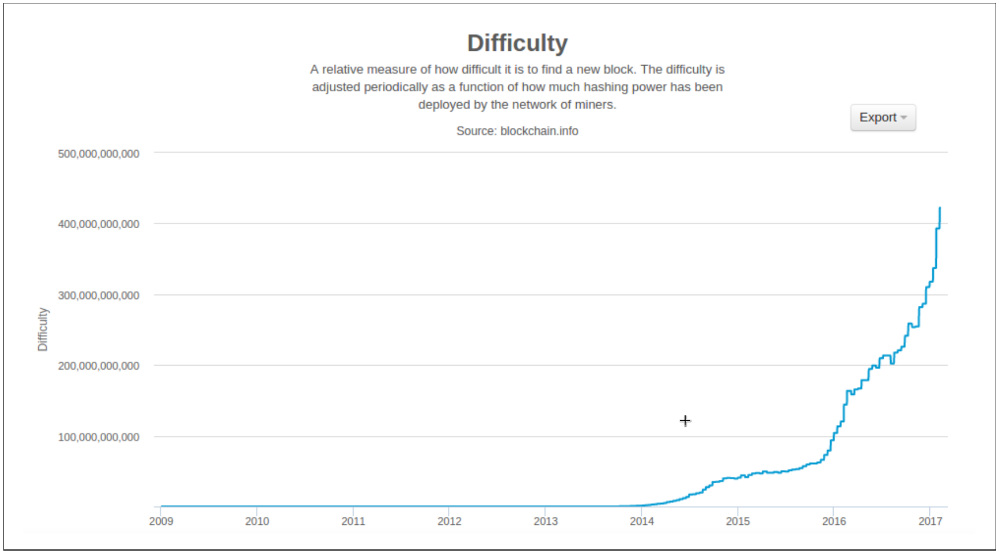

# Chapter 10. Mining and Consensus

## Introduction

- Mining is the mechanism that underpins the decentralized **clearinghouse** validating and clearing tx
- Mining is the invention that makes bitcoin special, a decentralized security mechanism that is the basis for P2P digital cash
- Mining secures the bitcoin system and enables the emergence of network-wide consensus without a central authority
- The reward of newly minted coins and transaction fees is an incentive scheme
  - aligns the actions of miners with the security of the network
  - simultaneously implementing the monetary supply
- Mining rewards consist of
  - new coins created with each new block
  - transaction fees from all the transactions included in the block
- Rewards is earned by means of compete to solve a difficult mathematical problem based on a cryptographic hash algorithm.
- The solution to the problem, called the **Proof-of-Work** (a.k.a., PoW), is included in the new block and acts as proof that the miner expended significant computing effort
- The competition to find the PoW to earn the reward and the right to record transactions on the blockchain is the basis for **bitcoin's security model**
- The process is called mining because the reward (new coin generation) is designed to simulate diminishing returns, just like mining for precious metals
- Today, the major incoming of bitcoin mining comes from the newly minted bitcoin (over >99.5%), which will beaten by tx fees gradually

### Bitcoin Economics and Currency Creation

> In practice, a miner may intentionally mine a block taking less than the full reward

The total amount of bitcoin can be calculated as [Example 10-1](examples/1_test.go)

- The finite and diminishing issuance creates a fixed monetary supply that resists inflation.

> **Deflationary Money**
>
> - Deflation is the phenomenon of appreciation of value due to a mismatch in supply and demand that drives up the value (and exchange rate) of a currency
> - The opposite of inflation, price deflation, means that the money has more purchasing power over time
> - In a fiat currency with the possibility of unlimited printing, it is very difficult to enter a deflationary spiral unless there is
>   - a complete collapse in demand, and
>   - an unwillingness to print money
> - Deflation in bitcoin is not caused by a collapse in demand, but by a predictably constrained supply

## Decentralized Consensus

- All traditional payment systems depend on a trust model that has a central authority providing a clearinghouse service, basi‐ cally verifying and clearing all transactions
- Satoshi Nakamoto's main invention is the decentralized mechanism for **emergent consensus**: consensus is an emergent artifact of the asynchronous interaction of thousands of independent nodes, all following simple rules
  - All the properties of bitcoin, including currency, transactions, payments, and the security model that does not depend on central authority or trust, derive from this invention
- Bitcoin's decentralized consensus emerges from the interplay of four processes that occur independently on nodes across the network
  - Independent verification of each transaction, by every full node, based on a comprehensive list of criteria
  - Independent aggregation of those transactions into new blocks by mining nodes, coupled with demonstrated computation through a PoW
  - Independent verification of the new blocks by every node and assembly into a chain
  - Independent selection, by every node, of the chain with the most cumulative computation demonstrated through PoW

## Independent Verification of Transactions

- Before being forwarded to other nodes, every received tx will be first verified against a long checklist as

  - The transaction's syntax and data structure must be correct.
  - Neither lists of inputs or outputs are empty.
  - The transaction size in bytes is less than `MAX_BLOCK_SIZE`.
  - Each output value, as well as the total, must be within the allowed range of values (less than 21m coins, more than the dust threshold)
  - None of the inputs have `hash=0`, `N=–1` (coinbase transactions should not be relayed)
  - `nLocktime` is equal to `INT_MAX`, or `nLocktime` and `nSequence` values are satisfied according to `MedianTimePast`
  - The transaction size in bytes is greater than or equal to 100
  - The number of signature operations (`SIGOPS`) contained in the transaction is less than the signature operation limit
  - The unlocking script (`scriptSig`) can only push numbers on the stack, and the locking script (`scriptPubkey`) must match `isStandard` forms (this rejects "non‐standard" transactions)
  - A matching transaction in the pool, or in a block in the main branch, must exist
  - For each input, if the referenced output exists in any other transaction in the pool, the transaction must be rejected
  - For each input, look in the main branch and the transaction pool to find the referenced output transaction. If the output transaction is missing for any input this will be an orphan transaction. Add to the orphan transactions pool, if a matching transaction is not already in the pool
  - For each input, if the referenced output transaction is a coinbase output, it must have at least `COINBASE_MATURITY` (100) confirmations
  - For each input, the referenced output must exist and cannot already be spent
  - Using the referenced output transactions to get input values, check that each input value, as well as the sum, are in the allowed range of values (less than 21m coins, more than 0)
  - Reject if the sum of input values is less than sum of output values
  - Reject if transaction fee would be too low (`minRelayTxFee`) to get into an empty block
  - The unlocking scripts for each input must validate against the corresponding output locking scripts

  > The conditions change over time, to address new types of denial-of-service attacks or sometimes to relax the rules so as to include more types of transactions

- The unconfirmed and valid tx is stored in _transaction pool_ (a.k.a, _memory pool_, _mempool_) before being progagated to others

## Mining Nodes

- 2 types of miners
  - full nodes
  - non-full nodes joining mining pools
- The new mined block is
  - a checkered flag marking the end of the race
  - the starting pistol in the race for the next block

## Aggregating Transactions into Blocks

- Validated txs residing in **mempool** waits until they can included/mined into a block
- Every mining round,
  - a winning miner would
    1. construct a _candidate block_
    2. struggle to find a PoW w.r.t the candidate block
    3. broadcast the mined block with a valid PoW to others
  - a losing miner would
    1. construct a _candidate block_
    2. struggle to find a PoW w.r.t the candidate block
    3. stop upon receiveing a mined block of the same height as that of the working candidate block
    4. remove the confirmed tx included in the mined block from mempool

> A winning block goes as [Example 10-3](examples/3_test.go)

### The Coinbase Transaction

- **DEFINITION**: the first transaction in any mined block (as [Example 10-4](examples/4_test.go))
- Coinbase tx does not consume (spend) UTXO as inputs. Instead, it has only one input, called the **coinbase**, which creates bitcoin from nothing

### Coinbase Reward and Fees

- `Fee = Sum(Inputs) - Sum(Outputs)`)
- Coinbase reward starts at 50 BTC/block and reduced by half every 210000 blocks (demo as [Example 10-5](examples/5_test.go)

### Structure of the Coinbase Transaction

- Table 10-1. The structure of a "normal" transaction input

| Size               | Field                 | Description                                                      |
| ------------------ | :-------------------- | :--------------------------------------------------------------- |
| 32 bytes           | Transaction Hash      | Pointer to the transaction containing the UTXO to be spent       |
| 4 bytes            | Output Index          | The index number of the UTXO to be spent, first one is 0         |
| 1–9 bytes (VarInt) | Unlocking-Script Size | Unlocking-Script length in bytes, to follow                      |
| Variable           | Unlocking-Script      | A script that fulfills the conditions of the UTXO locking script |
| 4 bytes            | Sequence Number       | Currently disabled Tx-replacement feature, set to `0xFFFFFFFF`   |

- Table 10-2. The structure of a coinbase transaction input

| Size               | Field              | Description                                                                                     |
| ------------------ | ------------------ | ----------------------------------------------------------------------------------------------- |
| 32 bytes           | Transaction Hash   | All bits are zero: Not a transaction hash reference                                             |
| 4 bytes            | Output Index       | All bits are ones: `0xFFFFFFFF`                                                                 |
| 1–9 bytes (VarInt) | Coinbase Data Size | Length of the coinbase data, from 2 to 100 bytes                                                |
| Variable           | Coinbase Data      | Arbitrary data used for extra nonce and mining tags. In v2 blocks; must begin with block height |
| 4 bytes            | Sequence Number    | Set to `0xFFFFFFFF`                                                                             |

### Coinbase Data

- Except for the first few bytes, the rest of the coinbase data can be used by miners in any way they want; it is arbitrary data
- Before BIP-34 is activated, the first few bytes of the coinbase used to be arbitrary
- As per BIP-34, version-2 blocks (blocks with the version field set to 2) must contain the block height index as a script `push` operation in the beginning of the coinbase field
- The ASCII-encoded string `/P2SH/` indicates that the mining node that mined this block supports the **P2SH** improvement defined in BIP-16

An demo to extract the coinbase data from the genesis block goes as [Example 10-6](examples/6_test.go)

## Constructing the Block Header

- The structure of the block header

  | Size     | Field               | Description                                                                      |
  | -------- | ------------------- | -------------------------------------------------------------------------------- |
  | 4 bytes  | Version             | A version number to track software/protocol upgrades                             |
  | 32 bytes | Previous Block Hash | A reference to the hash of the previous (parent) block in the chain              |
  | 32 bytes | Merkle Root         | A hash of the root of the merkle tree of this block's transactions               |
  | 4 bytes  | Timestamp           | The approximate creation time of this block (seconds from Unix Epoch)            |
  | 4 bytes  | Target              | The Proof-of-Work algorithm target (encoded as mantissa-exponent) for this block |
  | 4 bytes  | Nonce               | A counter (initialized as 0) used for the Proof-of-Work algorithm                |

## Mining the Block

- Mining is the process of hashing the block header repeatedly, changing one parameter, until the resulting hash matches a specific target (i.e., when parsed as number, the hash should be smaller than the target)

### Proof-of-Work Algorithm

- The key characteristic of a cryptographic hash algorithm is collision-resistant
- 3 demo of using SHA256
  - [Example 10-8. SHA256 example](examples/8_test.go)
  - [Example 10-9. SHA256 script for generating many hashes by iterating on a nonce](examples/9_test.go)
    - **The nonce is used to vary the output of a cryptographic function**
  - [Example 10-11. Simplified Proof-of-Work implementation](examples/11_test.go)
    - The PoW is a hash less than the target
    - The target and difficulty are inversely related

### Target Representation

- Target is expressed as a coefficient/exponent format, with

  - the first two hexadecimal digits for the exponent
  - the next six hex digits as the coefficient

  and calculated as

  ```
  target = coefficient * 2^(8 * (exponent – 3))
  ```

### Retargeting to Adjust Difficulty

- **Why**: to maintain the 10-minute block interval
- **When**: Every 2,016 blocks, all nodes retarget the PoW
- **How**

  ```
  New Target = Old Target * (Actual Time of Last 2016 Blocks / 20160 minutes)
  ```

  [Example 10-13. . Retargeting the Proof-of-Work -- calculateNextWorkRequired()](https://github.com/btcsuite/btcd/blob/306aecffea325e97f513b3ff0cf7895a5310651d/blockchain/difficulty.go#L221)

  > To avoid extreme volatility in the difficulty, the retargeting adjustment must be less than a factor of four (4) per cycle
  > The target is independent of the number of transactions or the value of transactions

## Successfully Mining the Block

- The newly mined block should be transmited to all peers to signal a winning

## Validating a New Block

A checklist goes as

- The block data structure is syntactically valid
- The block header hash is less than the target (enforces the Proof-of-Work)
- The block timestamp is less than two hours in the future (allowing for time errors)
- The block size is within acceptable limits
- The first transaction (and only the first) is a coinbase transaction
- All transactions within the block are valid

## Assembling and Selecting Chains of Blocks

> 4 steps of mining a block
>
> - construct the candidate block
> - mine the PoW and broadcast the resultant block on success
> - validate the incoming block and stop if valid
> - assemble the new block to local chain and pick the chain of most work

- 3 sets of blocks are maintained locally
  - ones connected to the main blockchain
  - ones on the branches off the main blockchain
  - orphan ones with unknown parents
- The "main chain" at any time is whichever **valid chain of blocks with the most cumulative PoW**
- Orphan blocks usually occur when two blocks that were mined within a short time of each other are received in reverse order (child before parent)
- The greatest-cumulative-work valid chain is the network-wide consensus

### Blockchain Forks

- Each node always selects and attempts to extend the chain of blocks that represents the most PoW, a.k.a., **the longest chain** or **greatest cumulative work chain**
- The greatest-cumulative-work chain drives the convergence to a consensus across the global bitcoin network
- The blockchain forks described in this section occur naturally as a result of transmission delays in the global network
- A "fork" occurs whenever there are two candidate blocks competing to form the longest blockchain
- Forks are almost always resolved within one block. A two-block fork occurs at most once every few weeks
- The unconfirmed tx in the **losing** branches of the main chain should be re-inserted into the mempool
- Bitcoin's block interval of 10 minutes is a design compromise between
  - **fast confirmation times (settlement of transactions)**, and
  - **the probability of a fork**

## Mining and the Hashing Race

- Hash rate vs time goes as
  
- Difficulty vs time goes as
  

### The Extra Nonce Solution

- **Why**
  - No valid nonces within the 4-byte (approximately 4 billion) integers
  - Once mining hardware exceeded 4 GH/sec, the nonce values were exhausted in less than a second
  - The timestamp could be stretched a bit, but moving it too far into the future would cause the block to become invalid
- **How**: use the coinbase transaction as a source of extra nonce values

### Mining Pools

- Miners now collaborate to form mining pools, pooling their hashing power and sharing the reward among thousands of participants
- Successful blocks pay the reward to a pool bitcoin address
- The pool server will periodically make payments to the miners' bitcoin addresses, once their share of the rewards has reached a certain threshold
- Miners participating in a pool **split the work of searching for a PoW** to a candidate block, earning "shares" for their mining contribution
- Reward allocation

  - use PoW as metric for contribution, but
  - with a less difficulty target

  > Thousands of miners trying to find low-value hashes will eventually find one low enough to satisfy the bitcoin network target

#### Managed pools

- **DEFINITION**: a pool run by a company or individual (a.k.a., **pool operator**)
- The pool server
  - connects to one or more full bitcoin nodes
  - has direct access to a full copy of the blockchain database
- It relieves the miners of mining with running a full node
- Pool miners connect to the pool server using a mining protocol such as **Stratum** (STM) or **GetBlockTemplate** (GBT)

#### Peer-to-peer mining pool (P2Pool)

- **Why**: Managed pools create the possibility of cheating by the pool operator, who might direct the pool effort to double-spend transactions or invalidate blocks
- P2Pool works by decentralizing the functions of the pool server, implementing a parallel blockchain-like system called a **share chain**
- The share chain allows all pool miners to keep track of all shares using a decentralized consensus mechanism like bitcoin's blockchain consensus mechanism
- On P2Pool, individual pool miners construct their own candidate blocks, aggregating transactions much like solo miners, but then mine collaboratively on the share chain
- **Problem**: conceivably vulnerable to 51% attacks against the share chain itself

## Consensus Attacks

- The consensus mechanism depends on having a majority of the miners acting honestly out of self-interest
- **Consensus attacks can only affect future consensus, or at best, the most recent past (tens of blocks)**

### 51% attack

- **What**: a group of miners, controlling a majority (51%) of the total network's hashing power, collude to attack bitcoin by making deliberate "forks"
- **How**: fork below previously confirmed blocks to invalidate them, and then reconverge on an alternate chain
- **Cases**
  - double spend **attacker's own txs**
  - DoS attacks against specific txs and addresses
- A double-spend attack can happen in two ways
  - before a transaction is confirmed, or
  - if the attacker takes advantage of a blockchain fork to undo several blocks
- **Counter Measure**
  - A merchant selling large-value items must wait at least six confirmations before giving the product to the buyer
- The hash power doesn't need to be 51%, but this rate guarantees success
- **Attacker**
  - pool operator in a managed pool
  - man intending to disrupt the bitcoin network without the possibility of profiting

## Changing the Consensus Rules

- **WHY**: to accommodate **new features**, **improvements**, or **bug fixes**

### Hard Forks

- **DEFINITION**: the network may diverge into following two chains due to a change in the consensus rules
- **WHY**
  - bugs
  - deliberate change in the implementation of the consensus rules
- Hard forks can be used to change the rules of consensus, but they require coordination between all participants in the system
- A change introduced by a hard fork can be thought of as not **"forward compatible,"** in that nonupgraded systems can no longer process the new consensus rules

### Hard Forks: Software, Network, Mining, and Chain

- **WHEN**: a deliberate change to the consensus rules
- **HOW**
  - a software fork as precondition
  - the new competing software must be adopted
  - the new rules is activated
- Consensus rules may differ in
  - obvious and explicit ways, in the validation of transactions or blocks
  - more subtle ways in implementation of bitcoin scripts or cryptographic primitives
  - unanticipated ways in form of implicit consensus constraints imposed by system limitations or implementation details
- **LIFE CYCLE**
  - a software fork
  - a network fork
  - a mining fork
  - a chain fork

### Diverging Miners and Difficulty

- As the hashing power is split between the chains,
  - The two chains would each inherit the difficulty from the retargeting period
  - And difficulty will adjust to be more easy for each chain in next retargeting process

### Contentious Hard Forks

- Any hard fork proposals that do not have near-unanimous support are considered too "contentious" to attempt without risking a partition of the system
- The issue of hard forks is highly controversial in the bitcoin development community, especially as it relates to any proposed changes to the consensus rules controlling **the maximum block size limit**

### Soft Forks

- **DEFINITION**: a forward-compatible change to the consensus rules that allows unupgraded clients to continue to operate in consensus with the new rules
- Only consensus changes that are forward-incompatible cause a fork
- A soft fork upgrades can only be used to **constrain the consensus rules, not to expand them**
- 2 Examples
  - Soft forks redefining NOP opcodes as BIP-65 (CHECKLOCKTIMEVERIFY) reinterpreting the `NOP2` opcode
  - Segwit modifies the locking script of UTXO

### Criticisms of Soft Forks

- **Technical debt**
  > Technical debt refers to increasing the future cost of code maintenance because of design tradeoffs made in the past
- **Validation relaxation** w.r.t nonupgraded clients
- **Irreversible upgrades** due to more constraints
  > critics contend that a failed soft fork that had to be reversed because of a bug would almost certainly lead to loss of funds

## Soft Fork Signaling with Block Version

- The mechanism for "activating" a soft fork is through miners signaling readines
- 2 mechanisms as the deprecated BIP-34 and the new BIP-9

### BIP-34 Signaling and Activation

- Used the **block version field** to allow miners to signal readiness for a specific consensus rule change
- BIP-34 defined a consensus rule change that required the coinbase field (input) of the coinbase transaction to contain the block height
- Two-step activation based on a rolling window of 1000 blocks
  - If recent `75%` are marked with version `2`, then version `2` blocks must contain block height in the coinbase transaction or they are rejected as invalid
  - When recent 95% are version `2`, version `1` blocks are no longer considered valid
- Use cases: BIP-66 and BIP-65

### BIP-9 Signaling and Activation

- **WHY**: BIP-34 has several limitations
  - By using the integer value of the block version, only one soft fork could be activated at a time
  - Monotonically increased block version doesn't offer a straightforward way to reject a change and then propose a different one
  - Each new change irrevocably reduced the available block versions for future changes
- **HOW**
  - interprets the block version as a bit field instead of a 4-byte integer
  - sets a maximum time `TIMEOUT` for signaling and activation
  - after the `TIMEOUT` has passed and a feature has been activated or rejected, the signaling bit can be reused for another feature without confusion
    > The authors of BIP-9 recommend that bits are reused only when necessary
- Relevant data structure containing fields as

  |       Field | Description                                                                                                                                |
  | ----------: | :----------------------------------------------------------------------------------------------------------------------------------------- |
  |      `name` | a short description, usually as `bipN`, where `N` is the BIP number                                                                        |
  |       `bit` | `0` to `28`, the bits on signal approval for the proposal                                                                                  |
  | `starttime` | the time based on **Median Time Past** signaling starts after which the bit's value is interpreted as signaling readiness for the proposal |
  |   `endtime` | The time (based on MTP) after which the change is considered rejected if it has not reached the activation threshold.                      |

- BIP-9 counts activation signaling in whole intervals based on the difficulty retarget period of 2016 blocks
- For every retarget period, if the sum of blocks signaling for a proposal exceeds 95% (1916 of 2016), the proposal will be activated **one retarget period later**
- A proposal state diagram as
  
- Use cases: `CHECKSEQUENCEVERIFY` (activated in July of 2016), BIP-68, BIP-112 and BIP-113

### Consensus Software Developmen

- Power is diffused between multiple constituencies such as miners, core developers, wallet developers, exchanges, merchants, and end users
- This diffusion of power means that all the participants must coordinate, or no changes can be made
- Status quo is the stable state of this system with only a few changes possible if there is strong consensus by a very large majority
- Both hard forks and soft forks involve tradeoffs
- The one constant characteristic
  - change is difficult, and
  - consensus forces compromise
