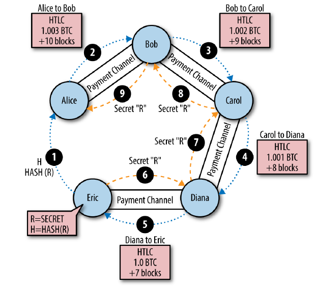

# Chapter 12. Blockchain Applications

## Payment Channels and State Channels

- **Payment channels** are a trustless mechanism for exchanging bitcoin transactions between two parties, outside of the bitcoin blockchain
  - These transactions, which would be valid if settled on the bitcoin blockchain, are held off-chain instead, acting as promissory notes for eventual batch settlement.
- **State channels** are virtual constructs represented by the exchange of state between two parties, outside of the blockchain
- **Channel** is used to represent the relationship and shared state between two parties, outside of the blockchain
- A payment channel is just a series of transactions
- 2 types of payment channels: **unidirectional** and **bidirectional**

### Relationship

- Payment channels are part of the broader concept of a state channel, which represents an off-chain alteration of state, secured by eventual settlement in a blockchain
- A payment channel is a state channel where the state being altered is the balance of a virtual currency

### State Channels - Basic Concepts and Terminology

#### Funding transaction (a.k.a. anchor transaction)

- Lifecycle
  1. Composed by **two parties**
  2. Transmitted to the network
  3. **Mined** to lock a shared state on the blockchain

#### Commitment tx

- Signed by both parties (the payer and the payee) to alter the initial state
- Are valid transactions that could be submitted for settlement by either party, but instead are held off-chain by each party pending the channel closure
- All previous states are invalidated by the most up-to-date commitment transaction, which is always the only one that can be redeemed.

#### Settlement tx

- A channel can be closed

  - Either cooperatively, by submitting a final settlement transaction to the blockchain, or
  - Unilaterally, by either party submitting the last commitment transaction to the blockchain

  > - Only the funding and settlement transactions need to be submitted for mining on the blockchain
  > - Any intermediate commitment transactions is held off-chain

### Simple Payment Channel Example

- **Assumption**: no cheater and unidirectional
- Emma buying the video streaming service (1 millibit/s) from Fabian using a payment channel

  1. Establish the channel with a tx (of total amount `a`) of Emma to a 2-of-2 multisignature address, with each of them holding one of the keys
  2. For `t` second of video, Emma updates the channel balance in form of a new commitment tx

  - Crediting `t` millibits to Fabian's address
  - Refunding `a-t` millibits back to Emma's address

> **Every commitment tx are sourced from the same 2-of-2 output from the funding tx**

### Making Trustless Channels

- **Problems** of the "simple payment channel"

  - Once constructed, funds will be lost if one of the parties disconnects before there is at least one commitment transaction signed by both parties
  - The payer can cheat by broadcasting a prior commitment that is in her favor

- Two solutions
  - Timelocks
  - Asymmetric revocable commitments

### Timelocks-based solution

- Tool: the tx-level **timelocks** `nLockTime`

- For payer

  1. Signs the **funding tx** privately without transmitting
  2. Constructs the **refund tx** timelocked to future and requests payee's signature
  3. Once getting the fully signed **refund tx**, transmitting the **funding tx** for mining

- Refund tx

  - Acts as the first commitment transaction
  - Its timelock establishes the upper bound for the channel's life

- Newer commitment tx should have shorter timelocks than the older ones and the refund tx, precluding these older ones from being redeemed to execute **double-spend attack**

- Settlement

  - Cooperative way: either party takes the most recent commitment transaction and builds a settlement transaction that is identical in every way except that it omits the timelock
  - Unilaterally: submit the most recent commitment tx to mine on chain and then wait for refunding until the timelock expires

- **2 disadvantages**
  - The lifetime of the channel is limited by the refund tx and intermediate commitment txs
  - `#(tx)` is limited due to the monotonically decreasing timelocks enforced by intermediate commitment txs

### Asymmetric revocable commitments

- The only way to cancel a transaction is by double-spending its inputs with another transaction before it is mined
- Tx can be constructed to be undesirable to use: gives each party a revocation key that can be used to punish the other party if they try to cheat

> The funding tx should exceed the channel capacity to cover the tx fees

#### Implementation

Two parties as A and B

- Every commitment tx 
  - Pays the payee immediately 
  - Forces the payer to wait for a short timelock to expire
- Every commitment tx of A looks like

  - This tx can be constructed by A only since nobody else knows the private key of `PK_A`
  - The revocation private key of the public key `RPK_A` is created and kept privately by A
  - On state transition, the private key corresponding to `RPK_A` would be revealed to B

  ```
  Input: 2-of-2 funding output, signed by A

  Output 0 <5 bitcoin>:
    PK_B CHECKSIG

  Output 1:
    IF
      # Revocation penalty output
      RPK_A
    ELSE
      <1000 blocks> CHECKSEQUENCEVERIFY DROP PK_A
    ENDIF
    CHECKSIG
  ```

- Symmetrically for B's side

  ```
  Input: 2-of-2 funding output, signed by B

  Output 0 <5 bitcoin>:
    PK_A CHECKSIG

  Output 1:
    IF
      # Revocation penalty output
      RPK_B
    ELSE
      <1000 blocks> CHECKSEQUENCEVERIFY DROP PK_B
    ENDIF
    CHECKSIG
  ```

#### Bilateral revocation protocol

- In each round, as the channel state is advanced, the two parties

  1. Exchange new commitments (**WITHOUT ANY SIGNATURE**)
  2. Exchange revocation keys for the previous commitment
  3. Sign each other's commitment transactions

- Suppose A is to pay B

  - For B, he would benefit, i.e. the upcoming state would grant him more balance, so he wouldn't broadcast the previous commitment tx
  - For A, her ability to cheat by broadcasting previous commitment has been revoked, since if she does that, A could redeem the exact tx outputs with the full signature (signed by `PK_A` and `RPK_B`)

  > **The revocation doesn't happen automatically**. The payee should watch the blockchain, and execute the revocation protocol within the delay specified in the payer's tx (i.e., 1000 blocks in our cases) which would weaken the revocability

- Asymmetric revocable commitments with relative time locks (CSV) are a much better way to implement payment channels and a very significant innovation in this technology

### Hash Time Lock Contracts (HTLC)

- **WHAT**: A special type of smart contract that allows participants to commit funds to **a redeemable secret**, with **an expiration time**
- **Hash** part: the intended recipent create a secret `R`, whose hash `H=Hash(R)` can be included in an output's locking script, and this output can be redeemed by everyone knows `R`
- **Time lock** part: payer will be refunded in case of no secret be revealed before the expiration of the time lock (achieved by `CHECKLOCKTIMEVERIFY`)
- A naive example HTLC script

  ```
  IF
    # Payment if you have the secret R
    HASH160 <H> EQUALVERIFY
  ELSE
    # Refund after timeout.
    <locktime> CHECKLOCKTIMEVERIFY DROP
    <Payee Pubic Key> CHECKSIG
  ENDIF
  ```

- A practical solution would be adding a `CHECKSIG` operator and a public key in the first clause restricts redemption of the hash to a named recipient, who must also know the secret `R`

## Routed Payment Channels (Lightning Network)

- **WHY**
  - Payer isn't connected to payee by a payment channel
  - A new payment channel would require a funding tx locked in blockchain

### Basic Lightning Network Example

- Step-by-step payment routing through a Lightning Network, is depicted as

  

- **Notices**: Both the **payment amount** and **time locks** are decremented hop by hop

### Lightning Network Transport and Routing

- **Prerequisite**: A long-term public key that they use as an identifier and to authenticate each other
- Every payment requires payer to construct a path through the network by connecting payment channels with **sufficient capacity**
- The routing path is only known to payer. All other participants in the payment route see only the adjacent nodes
  - Ensuring privacy of payments
  - Making it very difficult to apply surveillance, censorship, or blacklists
- Routing the path is always fixed at 20 hops and padded with random data which can signal the payee to stop secretly

### Lightning Network Benefits

- Privacy
- Fungibility: more difficult to apply surveillance and blacklists
- Speed
- Granularity: enable payments even below "dust" limit
- Capacity
- Truestless operation
